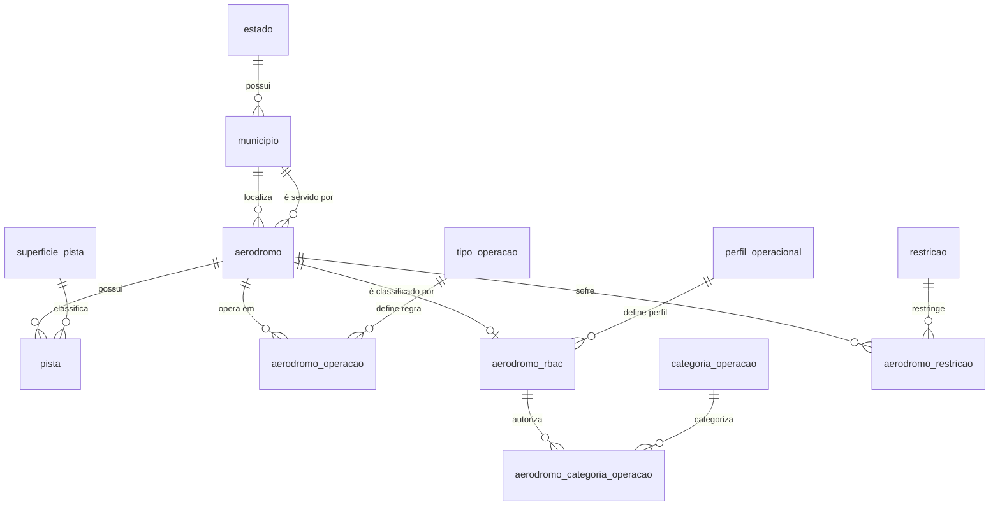

# Aeródromos da Região Norte (ANAC)

Banco de dados PostgreSQL normalizado até a 3ª Forma Normal, construído a partir
do arquivo `anac_aerodromos_norte.csv` — cadastro de 809 aeródromos públicos e
privados da Região Norte, em 34 colunas.

## Equipe

- Pedro Andrade Gonçalves de Souza
- Julia Labad Jatene
- Luan Piedade de Oliveira
- Jõao Paulo Oliveira Rodrigues

## Arquivos

| Ordem | Arquivo | Conteúdo |
|---|---|---|
| 1º | `trabalho_aerodromo.sql` | **Script DDL** — criação das 13 tabelas, chaves, restrições e índices |
| 2º | `carga_aerodromo.sql` | **Script de carga** — 3.004 linhas em 22 comandos `INSERT` |
| — | `anac_aerodromos_norte.csv` | Dados de origem, para rastreabilidade |

## Como executar

Em um banco vazio, nesta ordem:

```bash
createdb -U postgres aerodromos_norte
psql -U postgres -d aerodromos_norte -f trabalho_aerodromo.sql
psql -U postgres -d aerodromos_norte -f carga_aerodromo.sql
```

No Windows, defina `PGCLIENTENCODING=UTF8` antes de executar: os scripts estão
em UTF-8 e o psql assume WIN1252 por padrão, o que corromperia os acentos e
faria o `CHECK` de `tipo_uso` falhar.

```powershell
$env:PGCLIENTENCODING = 'UTF8'
```

O script de carga termina com uma consulta de conferência que compara a
contagem de cada tabela com o valor esperado e imprime `OK` ou `DIVERGENTE`.

## Modelo



### Contagem por tabela

| Tabela | Linhas | Papel |
|---|---:|---|
| `estado` | 7 | Domínio das UFs |
| `municipio` | 242 | Localização, nos dois papéis |
| `superficie_pista` | 9 | Domínio de superfície |
| `tipo_operacao` | 3 | VFR, IFR, Sem Operação |
| `perfil_operacional` | 3 | Perfil RBAC 153 |
| `categoria_operacao` | 3 | Categorias de operação autorizada |
| `restricao` | 9 | Textos de restrição operacional |
| `aerodromo` | 809 | Entidade central |
| `pista` | 653 | Pistas de pouso e decolagem |
| `aerodromo_operacao` | 1.163 | Regras de voo por período |
| `aerodromo_rbac` | 71 | Classificação regulatória |
| `aerodromo_categoria_operacao` | 13 | Categorias por aeródromo |
| `aerodromo_restricao` | 19 | Restrições por aeródromo |
| **Total** | **3.004** | |

## Decisões de modelagem

### Por que `municipio` é uma tabela só

O CSV traz dois pares de localização: `municipio` + `uf` (onde o aeródromo
fica) e `municipio_servido` + `uf_servido` (qual município ele atende). Duas
tabelas separadas repetiriam o mesmo município nas duas, então existe uma
tabela `municipio` única e a distinção de papel fica nas **duas chaves
estrangeiras** de `aerodromo`: `id_municipio` (obrigatória) e
`id_municipio_servido` (opcional, preenchida em 77 dos 809 registros).

Há uma pegadinha nos dados: a coluna `municipio` grafa em caixa alta
(`RIO BRANCO`) e `municipio_servido` grafa capitalizado (`Rio Branco`) — é o
mesmo município. O casamento entre as duas colunas é feito com uma chave sem
acento e em caixa alta; sem isso, os 71 municípios servidos entrariam
duplicados e a tabela teria 313 linhas em vez de 242. A forma gravada é a da
coluna `municipio`, verbatim do CSV.

Nenhum nome de município se repete entre UFs diferentes neste recorte, mas a
chave natural correta é o par `(nome, uf)`, e é esse o `UNIQUE` da tabela.

### Por que `pista` é uma entidade separada

As colunas `pista1_*` descrevem outra entidade dentro da mesma linha do CSV.
Mantê-las em `aerodromo` traria dois problemas: 156 dos 809 aeródromos não têm
pista alguma, o que deixaria dez colunas nulas nessas linhas, e um segundo
registro de pista exigiria colunas `pista2_*`, `pista3_*` — o sintoma clássico
de grupo repetitivo, que viola a 1FN.

A chave primária de `pista` é a própria pista, não o aeródromo. Neste recorte
cada aeródromo tem no máximo uma, mas o relacionamento é 1:N e aceita uma
segunda pista sem alteração de estrutura. O `UNIQUE (id_aerodromo, designacao)`
impede a mesma designação repetida no mesmo aeródromo.

### Colunas multivaloradas

Três colunas guardam mais de um valor na mesma célula, separados por `" / "`:

- **`operacao_diurna`** e **`operacao_noturna`** — ex.: `VFR / IFR`. Valores
  atômicos: `VFR`, `IFR`, `Sem Operação`. Uma célula com dois valores viola a
  1FN, então foram decompostas em `aerodromo_operacao`, com uma linha por par
  (período, regra de voo). Uma tabela única atende as duas colunas, com
  `periodo` como parte da chave primária — não são necessárias duas tabelas.

- **`operacao_internacional`** — apesar do nome, **não guarda um booleano**:
  guarda uma ou duas categorias de operação, como
  `Público Táxi Aéreo e Aviação Geral (RNS) / Público Regular ou Charter (AS)`.
  Decomposta em `aerodromo_categoria_operacao`.

O código PCN de resistência (`78/F/D/X/T`) **não** foi decomposto: apesar das
barras, é um identificador técnico padronizado da OACI lido como unidade, não
uma lista de valores independentes.

### Como a 3FN foi alcançada

A dependência transitiva eliminada é sempre a mesma: um texto descritivo que
depende de um valor de domínio, e não da chave da tabela. Em `pista`, se a
superfície fosse a coluna `'Asfalto'`, o texto dependeria do tipo de superfície
— não do `id_pista`. Por isso cinco domínios viraram tabelas próprias:
`superficie_pista`, `tipo_operacao`, `perfil_operacional`,
`categoria_operacao` e `restricao`.

O caso mais claro é `restricao`: 19 aeródromos têm restrição, mas existem
apenas **9 textos distintos** — um deles com 279 caracteres, repetido em 5
aeródromos.

Códigos curtos e autoexplicativos ficaram como `CHECK`, não como tabela:
`classe_rbac153` (1, 2, 3) e `classe_rbac107` (`AP-0`, `AP-1`, `AP-2`) não
carregam atributo descritivo próprio que justifique o `JOIN`.

### Por que `aerodromo_rbac` é 1:1 opcional

`classe_rbac153`, `perfil_operacional_rbac153`, `classe_rbac107` e
`operacao_internacional` estão preenchidas em **apenas 71 dos 809** registros,
e sempre em conjunto — nunca uma sem a outra. Mantê-las em `aerodromo` deixaria
738 linhas com quatro colunas nulas. Na tabela 1:1 opcional existem somente os
71 registros que de fato possuem classificação.

`aerodromo_categoria_operacao` referencia `aerodromo_rbac`, e não `aerodromo`,
porque nos dados toda categoria de operação pertence a um aeródromo que possui
classificação regulatória — a FK transforma essa regra de negócio em restrição
do banco.

### O que ficou em `aerodromo`

`validade_cadastro` e `link_portaria_cadastro` são atributos monovalorados que
dependem apenas da chave primária do aeródromo. Uma tabela `cadastro` separada
não eliminaria nenhuma dependência: só acrescentaria um `JOIN`. Por isso
permaneceram na tabela central.

## Restrições derivadas do perfilamento dos dados

Cada restrição abaixo foi verificada contra os 809 registros antes de entrar no
DDL — nenhuma delas quebra a carga.

- **Resistência mutuamente exclusiva.** 530 pistas informam o par (kg, MPa) e
  123 informam a notação PCN. Nenhuma informa as duas, nenhuma deixa as duas em
  branco. O `CHECK` exige exatamente uma das duas formas.
- **`tipo_uso` aceita NULL.** Três registros não informam tipo de uso (ids
  7980, 16249 e 16882). `NOT NULL` aqui faria a carga falhar.
- **`codigo_oaci` é `UNIQUE` e nulável.** 476 aeródromos têm código e todos são
  distintos; o PostgreSQL permite múltiplos `NULL` em coluna `UNIQUE`, que é
  exatamente o comportamento desejado para os 333 sem código.
- **`codigo_oaci` é alfanumérico.** Sete códigos contêm dígito (`SD7H`, `SD6X`,
  `SDL4`, `SDP8`, `SD6Y`, `SDV3`, `SJ3M`), então o padrão é `^[A-Z0-9]{4}$` e
  não `^[A-Z]{4}$`.
- **`ciad` segue `^[A-Z]{2}[0-9]{4}$`** — 809 de 809 conferem. O prefixo
  **não** pode ser usado para derivar a UF: em 4 registros ele divergia da UF
  informada.
- **`luzes_eixo` e `luzes_borda` aceitam NULL** — 110 e 97 pistas não informam.
- **`validade_cadastro` sem limite superior.** A fonte tem um registro com ano
  3032, provável erro de digitação da ANAC. O `CHECK` só garante
  `>= 2000-01-01`; um limite superior apertado quebraria a carga.

Tamanhos de `VARCHAR` foram dimensionados pelo valor máximo real de cada
coluna. São 16 índices: todas as chaves estrangeiras, mais `situacao`,
`tipo_uso`, `nome`, `validade_cadastro`, `comprimento_m`, `periodo` e
`classe_rbac153`.

## Como os dados foram carregados

O CSV foi perfilado em Python (contagem de nulos, cardinalidade, teste de
dependência funcional, detecção das células multivaloradas) e o resultado desse
perfilamento definiu tanto as restrições do DDL quanto as tabelas de domínio.

Em seguida, um gerador em Python produziu o `carga_aerodromo.sql`. **A
entrega é SQL puro:** o script não lê o CSV em tempo de execução e não depende
de caminho de arquivo, de `COPY` do lado servidor nem de permissão
`pg_read_server_files`. Roda em qualquer máquina, inclusive pelo pgAdmin.

Os identificadores das tabelas com `SERIAL` são gravados explicitamente, para
que as chaves estrangeiras possam referenciá-los sem subconsulta. No fim do
script, um `setval` por sequência as reposiciona, de modo que um `INSERT`
manual posterior não colida com os ids já usados. Tudo está dentro de um
`BEGIN` / `COMMIT`: se qualquer linha violar uma restrição, a carga inteira é
desfeita e o banco não fica pela metade.

## Mapeamento das 34 colunas do CSV

Nenhuma informação da planilha foi descartada.

| Coluna do CSV | Destino |
|---|---|
| `id_aerodromo` | `aerodromo.id_aerodromo` |
| `ciad` | `aerodromo.ciad` |
| `codigo_oaci` | `aerodromo.codigo_oaci` |
| `tipo_uso` | `aerodromo.tipo_uso` |
| `nome` | `aerodromo.nome` |
| `municipio` | `municipio.nome` via `aerodromo.id_municipio` |
| `uf` | `municipio.uf` → `estado.sigla` |
| `municipio_servido` | `municipio.nome` via `aerodromo.id_municipio_servido` |
| `uf_servido` | `municipio.uf` via `aerodromo.id_municipio_servido` |
| `latitude` | `aerodromo.latitude` |
| `longitude` | `aerodromo.longitude` |
| `altitude_m` | `aerodromo.altitude_m` |
| `operacao_diurna` | `aerodromo_operacao` com `periodo = 'Diurno'` |
| `operacao_noturna` | `aerodromo_operacao` com `periodo = 'Noturno'` |
| `pista1_id` | `pista.id_pista` |
| `pista1_designacao` | `pista.designacao` |
| `pista1_comprimento_m` | `pista.comprimento_m` |
| `pista1_largura_m` | `pista.largura_m` |
| `pista1_resistencia_kg` | `pista.resistencia_kg` |
| `pista1_resistencia_mpa` | `pista.resistencia_mpa` |
| `pista1_resistencia_pcn` | `pista.resistencia_pcn` |
| `pista1_superficie` | `superficie_pista.descricao` via `pista.id_superficie` |
| `pista1_luzes_eixo` | `pista.luzes_eixo` |
| `pista1_luzes_borda` | `pista.luzes_borda` |
| `situacao` | `aerodromo.situacao` |
| `classe_rbac153` | `aerodromo_rbac.classe_rbac153` |
| `perfil_operacional_rbac153` | `perfil_operacional.descricao` via `aerodromo_rbac.id_perfil` |
| `classe_rbac107` | `aerodromo_rbac.classe_rbac107` |
| `operacao_internacional` | `categoria_operacao` via `aerodromo_categoria_operacao` |
| `certificacao_operacional` | `aerodromo.certificacao_operacional` |
| `validade_cadastro` | `aerodromo.validade_cadastro` |
| `link_portaria_cadastro` | `aerodromo.link_portaria_cadastro` |
| `restricao` | `restricao.descricao` via `aerodromo_restricao` |
| `amazonia_legal` | `aerodromo.amazonia_legal` |
